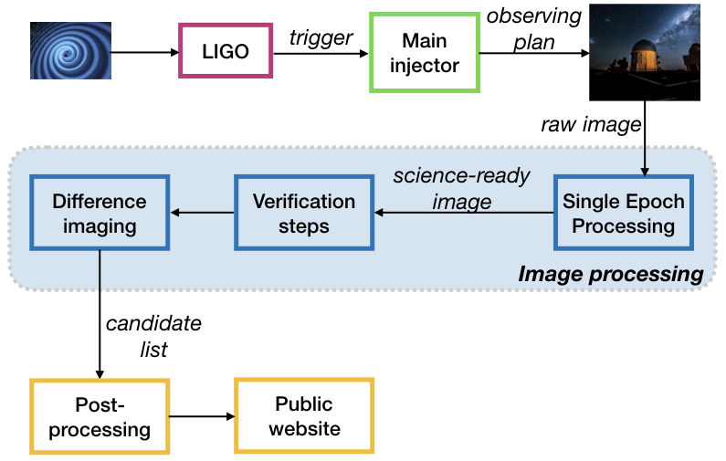
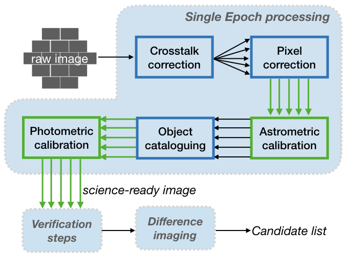

# gw_workflow
#
Image processing portion of the DES-GW pipeline. Currently consists of single-epoch (SE) processing and difference imaging. 

* [Introduction](#introduction)  
* [Background](#background)
    * [Single-Epoch Processing](#single-epoch-se-processing)
    * [Verification](#verification-steps)
    * [Difference Imaging](#difference-imaging)
* [Demo](#demo)  
    * [Setup](#setup)  
    * [Full Image Processing](#running-the-full-image-processing-pipeline-sediffsh)
    * [Pipeline Subsets](#running-subsets-of-the-pipeline)  
        * [SE processing](#running-single-epoch-se-processing-only-with-se_job_modsh)
        * [Astrometric Calibration](#running-astrometric-calibration-only-with-bliss-expcalib_y3apasspy)
        * [Difference Imaging](#running-difference-imaging-only-with-run_diffimg_pipelinesh)  

## Introduction

The goal of this project is to speed up the pipeline by about a factor of 10. So far, the progress done is as follows:

* A parallelized (CCD-by-CCD) version of SE processing (which resulted in an approximately factor 5 speedup of `SE_job_mod.sh`)
* SE processing calls `BLISS-expCalib_Y3apass.py` for photometric calibration of images taken outside the DES footprint. Due to the implementation of CCD-by-CCD processing, the image to be calibrated covers only has the area of a CCD, which is far less than previously, causing us to switch to the GAIA DR-2 sky catalog and a finer catalog pixelation. This was implemented with a new function `getallccdfromGAIA` in the BLISS python script.  
    * The GAIA catalog was originally 1.3T in size. We selected the relevant columns only and copied the catalog to persistent storage for easy access (in `/cvmfs/des.osgstorage.org/stash/ALLSKY_STARCAT/GAIA_DR2`). This reduced the size by a factor of 12 to 110G.
    * The BLISS script now also has a CCD flag, like `SE_job_mod.sh` did, to implement the CCD-by-CCD SE processing and put the CCD number in the output files.
* SE processing (`SE_job_mod.sh`), verification steps (`verifySE.sh`), and difference imaging (`RUN_DIFFIMG_PIPELINE.sh`) were combined into a single image processing script called `SEdiff.sh`.

## Background

The image processing pipeline is a subset (shown in blue) of the full DES-GW pipeline below:


### Single-Epoch (SE) Processing

A flowchart detailing the SE processing steps is shown below:
   
Green indicates changes made since the O2 pipeline.

### Verification Steps

### Difference Imaging

The DiffImg section includes setup steps and a 28-step pipeline, detailed below:
(diagram has not yet been finalized)

## Demo

### Setup

These scripts should be run on the cluster machines. As these jobs tend to take a long time, you may want to run it in Screen. SSH into a machine and follow the instructions below to set up the environment.
```
screen

export CONDA_DIR=/cvmfs/des.opensciencegrid.org/fnal/anaconda2
source $CONDA_DIR/etc/profile.d/conda.sh
conda activate des18a

# ONLY RUN if you are not logged in as the desgw user
kx509
voms-proxy-init -rfc -noregen -voms des:/des/Role=Analysis -valid 24:00

source /cvmfs/des.opensciencegrid.org/eeups/startupcachejob21i.sh
```

### Running the full Image Processing Pipeline (`SEdiff.sh`)

Before running the image processing pipeline, we need to run `DAGMaker.sh`, which sets some environmental variables and creates files and folders expected by the pipeline. This script reads the config file `dagmaker.rc`. Most likely, the only fields of interest are `RNUM`, `PNUM`, and `SEASON`. These are some counters that keep track of the processing version (the first two) and an arbitrary season counter. Once this file has been modified with the desired parameters, run
```
# this reads config file dagmaker.rc (be sure the variables are set to the desired values before running)
./DAGMaker EXPNUM
```
where `EXPNUM` is the exposure number you will do image processing on. `DAGMaker.sh` will do a quick overlap calculation to determine what template images correspond to this search exposure and check if they have been processed yet. Its end product is a file called `desgw_pipeline_EXPNUM.dag`. This is a directed acyclic graph (DAG) which describes the manner the necessary image processing scripts need to be run, i.e. process template images in parallel (if they have not yet been processed), then process the search image. (**NOTE:** as of August 7, 2018, this script has not yet been modified to account for the new combined pipeline layout. For now, you should not use a jobsub and run the steps manually as described in the next paragraph.) This plan can then be executed with jobsub as follows:
```
jobsub_submit_dag -G des file://desgw_pipeline_EXPNUM.dag
```

The steps contained in the DAG file (i.e. the image processing pipeline) can also be executed manually, for example:
```
./SEdiff.sh -r 4 -p 7 -E 668443 -b i -n 20170817 -d persistent -m gw -v gw6 -C -O -c 33 -S dp67 -V SNVETO_668443_33_r4p7.LIST -T SNSTAR_668443_33_r4p7.LIST
```

#### Flags
* `r`: RNUM
* `p`: PNUM
* `E`: Exposure number
* `b`: Band (`i`, `r`, `g`, `Y`, `z`, or `u`)
* `n`: Night
* `c`: CCD number (takes a comma-separated list)
* `d`: Destination cache (`scratch` or `persistent`)
* `m`: Schema (`gw` or `wsdiff`)
* `v`: DiffImg version
* `S`: Season number (e.g. `dp59`)
* `V`: SNVETO name (for `makestarcat.py`, which makes a star catalog to be used if the exposure is outside the DES footprint)
* `T`: STARCAT name (again for `makestarcat.py`)

**Note**: If the V and T flags are not provided, the `makestarcat.py` step will be skipped (do this when the exposure is in the DES footprint).

The following flags do not require arguments:

* `C`: Run image calibration (for images outside the DES footprint)
* `j`: Skip SE processing and go straight to image calibration
* `s`: Run single-threaded
* `Y`: Turn on `SPECIALY4`
* `F`: Turn on `FULLCOPY`
* `O`: Fetch all files again, overwriting those already in the current directory (essentially re-does SE processing even if it has already been completed)
* `t`: Run SE for a template image (exits after SE, skipping verification and diffimg)
* `h`: Help

### Running subsets of the pipeline

#### Running Single-Epoch (SE) Processing Only with `SE_job_mod.sh`

After following the setup steps above, you can run the SE processing script. For example, type:
```
# to run all CCDs in series
./SE_job_mod.sh -r 4 -p 5 -E 668439 -b i -n 20170817 -d persistent -m gw -C -O -S dp60

# to run a single CCD
./SE_job_mod.sh -r 4 -p 5 -E 668439 -b i -n 20170817 -d persistent -m gw -C -O -S dp60 -c 1
```

##### Flags
* `r`: RNUM
* `p`: PNUM
* `E`: Exposure number
* `b`: Band (`i`, `r`, `g`, `Y`, `z`, or `u`)
* `n`: Night
* `c`: CCD number
* `d`: Destination cache (`scratch` or `persistent`)
* `m`: Schema (`gw` or `wsdiff`)
* `S`: Season number (e.g. `dp59`)

The following flags do not require arguments:

* `C`: Run image calibration (for images outside the DES footprint)
* `j`: Skip SE processing and go straight to image calibration
* `s`: Run single-threaded
* `Y`: Turn on `SPECIALY4`
* `O`: Fetch all files again, overwriting those already in the current directory
* `t`: Run SE for a template image (skips SE verify steps at the end)
* `h`: Help

SE processing includes astrometric calibration, which you can run by itself as described in the following subsection.

#### Running Astrometric Calibration Only with `BLISS-expCalib_Y3apass.py`  

Astrometric Calibration is one step in the SE processing pipeline (above). After the setup steps (above), however, you can also choose to run only the BLISS calibration script instead of the full SE pipeline.  

**Note:** `SE_job_mod.sh` executes the script `BLISS-expCalib_Y3apass.py`. Due to deprecated package versions (should be fixed soon!), the SE script calls the deprecated version of the BLISS script, `BLISS-expCalib_Y3apass-old.py`. When running the BLISS script on its own, however, use the new version, `BLISS-expCalib_Y3apass.py` as follows:  
```
./BLISS-expCalib_Y3apass.py --expnum 668439 --reqnum 4 --attnum 5 --ccd 1
```

##### Flags
* `expnum`: Exposure number
* `reqnum`: RNUM
* `attnum`: PNUM
* `ccd`: CCD number
* `magsType`: Mag type to use (e.g. `mag_psf`, `mag_auto`, `mag_aper_8`)
* `sex_mag_zeropoint`: Default sextractor zeropoint to use to convert fluxes to sextractor mags
* `verbose`: verbosity level of output to screen (0,1,2,...)

The following flags do not require arguments:

* `debug`: Run in debug org

#### Running Difference Imaging Only with `RUN_DIFFIMG_PIPELINE.sh`

To run difference imaging, follow the same setup steps, then run the following:  
```
./RUN_DIFFIMG_PIPELINE.sh -E 668439 -r r4p5 -p dp60 -n 20170817 -b i -c 36 -d persistent -m gw
```

##### Flags
Note that these vary significantly from the same letter in SE processing:  

* `E`: Exposure number
* `r`: RPNUM
* `p`: Season number
* `n`: Night
* `b`: Band (`i`, `r`, `g`, `Y`, `z`, or `u`)
* `c`: CCD number
* `d`: Destination cache (`scratch` or `persistent`)
* `m`: Schema (`gw` or `wsdiff`)
* `v`: Diffimg version

The following flags do not require arguments:  

* `F`: fullcopy
