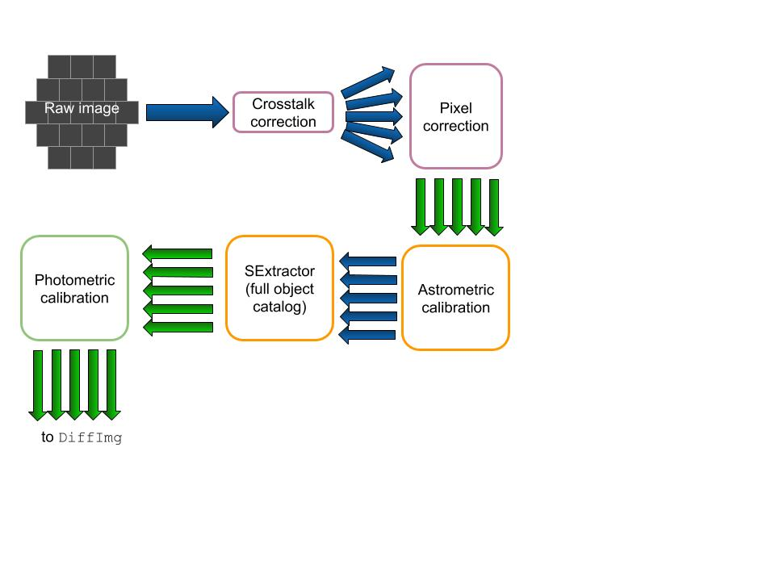

# gw_workflow
Workflow for image processing. Currently consists of single-epoch (SE) processing and difference imaging. 

[Introduction](#introduction)  
[Demo](#demo)

## Introduction

The goal of this project is to speed up the pipeline by about a factor of 10. So far, the progress done is as follows:

* A parallelized (CCD-by-CCD) version of SE processing (which resulted in an approximately factor 5 speedup of `SE_job_mod.sh`)
* SE processing calls `BLISS-expCalib_Y3apass.py` for photometric calibration of images taken outside the DES footprint. Due to the implementation of CCD-by-CCD processing, the image to be calibrated covers only has the area of a CCD, which is far less than previously, causing us to switch to the GAIA DR-2 sky catalog and a finer catalog pixelation. This was implemented with a new function `getallccdfromGAIA` in the BLISS python script.  
    * The GAIA catalog was originally 1.3T in size. We selected the relevant columns only and copied the catalog to persistent storage for easy access (in `/cvmfs/des.osgstorage.org/stash/ALLSKY_STARCAT/GAIA_DR2`). This reduced the size by a factor of 12 to 110G.
    * The BLISS script now also has a CCD flag, like `SE_job_mod.sh` did, to implement the CCD-by-CCD SE processing and put the CCD number in the output files.

## Demo

#### Setup

These scripts should be run on the cluster machines. As these jobs tend to take a long time, you may want to run it in Screen. SSH into a machine and follow the instructions below to set up the environment.
```
screen

export CONDA_DIR=/cvmfs/des.opensciencegrid.org/fnal/anaconda2
source $CONDA_DIR/etc/profile.d/conda.sh
conda activate des18a

kx509
voms-proxy-init -rfc -noregen -voms des:/des/Role=Analysis -valid 24:00

source /cvmfs/des.opensciencegrid.org/eeups/startupcachejob21i.sh
```

#### Running Single Epoch (SE) Processing (`SE_job_mod.sh`)

A flowchart detailing the SE processing steps is shown below:

Green indicates changes made since the O2 pipeline.

After following the setup steps above, you can run the SE processing script. For example, type:
```
# to run all CCDs in series
./SE_job_mod.sh -r 4 -p 5 -E 668439 -b i -n 20170817 -d persistent -m gw -C -O -S dp60

# to run a single CCD
./SE_job_mod.sh -r 4 -p 5 -E 668439 -b i -n 20170817 -d persistent -m gw -C -O -S dp60 -c 1
```

##### Flags
* `r`: RNUM
* `p`: PNUM
* `E`: Exposure number
* `b`: Band (`i`, `r`, `g`, `Y`, `z`, or `u`)
* `n`: Night
* `c`: CCD number
* `d`: Destination cache (`scratch` or `persistent`)
* `m`: Schema (`gw` or `wsdiff`)
* `S`: Season number

The following flags do not require arguments:

* `C`: Run image calibration (for images outside the DES footprint)
* `j`: Skip SE processing and go straight to image calibration
* `s`: Run single-threaded
* `Y`: Turn on `SPECIALY4`
* `O`: Fetch all files again, overwriting those already in the current directory
* `t`: Run SE for a template image (skips SE verify steps at the end)
* `h`: Help

To run all 60 CCDs in parallel, create a directed acyclic graph (DAG) by running `./dag-create.sh`. This will produce the file `parallel.dag` which can then be run with jobsub:
```
source /cvmfs/des.opensciencegrid.org/eeups/startupcachejob21i.sh
jobsub_submit_dag -G des file://parallel.dag
```

##### Running Astrometric Calibration Only with `BLISS-expCalib_Y3apass.py`  

Astrometric Calibration is one step in the SE processing pipeline (above). After the setup steps (above), however, you can also choose to run only the BLISS calibration script instead of the full SE pipeline.  

**Note:** `SE_job_mod.sh` executes the script `BLISS-expCalib_Y3apass.py`. Due to deprecated package versions (should be fixed soon!), the SE script calls the deprecated version of the BLISS script, `BLISS-expCalib_Y3apass-old.py`. When running the BLISS script on its own, however, use the new version, `BLISS-expCalib_Y3apass.py` as follows:  
```
./BLISS-expCalib_Y3apass.py --expnum 668439 --reqnum 4 --attnum 5 --ccd 1
```

##### Flags
* `expnum`: Exposure number
* `reqnum`: RNUM
* `attnum`: PNUM
* `ccd`: CCD number
* `magsType`: Mag type to use (e.g. `mag_psf`, `mag_auto`, `mag_aper_8`)
* `sex_mag_zeropoint`: Default sextractor zeropoint to use to convert fluxes to sextractor mags
* `verbose`: verbosity level of output to screen (0,1,2,...)

The following flags do not require arguments:

* `debug`: Run in debug org

#### Difference Imaging

To run difference imaging, follow the same setup steps, then run the following:  
```
./RUN_DIFFIMG_PIPELINE.sh -E 668439 -r r4p5 -p dp60 -n 20170817 -b i -c 36 -d persistent -m gw
```

##### Flags
Note that these vary significantly from the same letter in SE processing:  

* `E`: Exposure number
* `r`: RPNUM
* `p`: Season number
* `n`: Night
* `b`: Band (`i`, `r`, `g`, `Y`, `z`, or `u`)
* `c`: CCD number
* `d`: Destination cache (`scratch` or `persistent`)
* `m`: Schema (`gw` or `wsdiff`)
* `v`: Diffimg version

The following flags do not require arguments:  

* `F`: fullcopy
